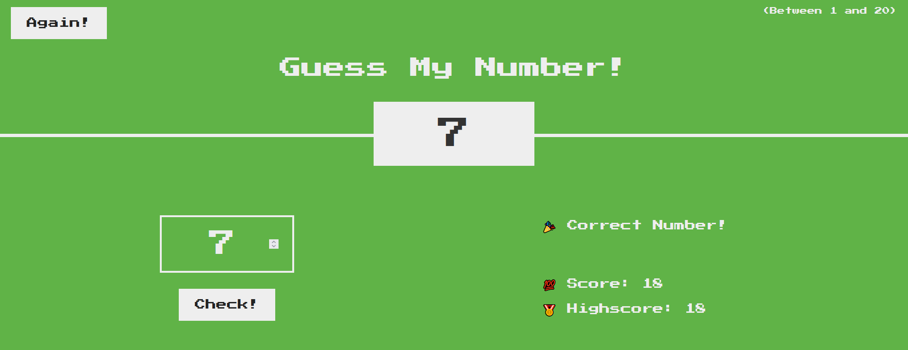

# JS-Guess-My-Number-Game

JavaScript Guess My Number Game

<!-- Live link to deployed app -->

Repository: https://github.com/Mdudzik92/JS-Guess-My-Number-Game 
Deployed app: https://mdudzik92.github.io/JS-Guess-My-Number-Game/

<!-- Technologies used -->

HTML, CSS, JavaScript

<!-- Explanation of what the app is -->

This is a number guessing game in which the user can input a number between 1 and 20 until they have guessed the correct number. Once they have chosen the correct number the screen changes color and their high score is added to the high score list. Each time the user guesses the number incorrectly, their current score is deducted by one. Give it a try by clicking the link or downloading the repo and have some fun!

<!-- Screenshot -->

<!-- License -->

MIT

<!-- Contact information -->

Email: mdudzik92@gmail.com
